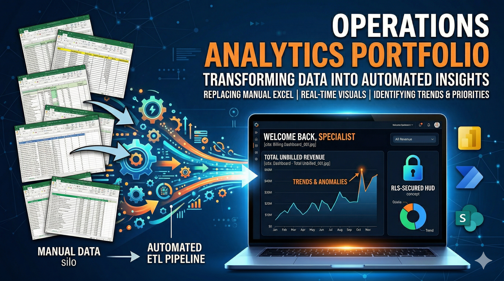

# Operations & Data Analytics Portfolio

## Overview
I am a Technical Operations Analyst specializing in data-driven process improvement, workflow automation, and operational analytics. This portfolio showcases real-world reporting and analytics solutions designed to improve visibility, reduce manual effort, and support business decision-making.

My work focuses on bridging the gap between operations and technology by building scalable systems, dashboards, and data models.

---

## Core Skills
- Data Analysis & Visualization (Power BI, DAX)
- SQL & Relational Data Modeling
- Workflow Automation (Power Platform)
- Operational Process Improvement
- Reporting & Dashboard Development

---

## Featured Projects

### 1. Invoice Adjustment Audit Dashboard
**Objective:** Improve visibility into invoice adjustments and reduce manual audit processes.

**Highlights:**
- Integrated multiple Azure SQL data sources into a relational model
- Developed interactive Power BI dashboards with drill-through capabilities
- Implemented DAX-based time intelligence for quarterly and trend analysis
- Built exportable reporting views for audit workflows
- Configured automated daily data refresh

**Impact:**
- Reduced reliance on manual Excel tracking
- Improved audit efficiency and accuracy
- Enabled faster identification of anomalies and trends

---

### 2. Unbilled Revenue & Backlog Dashboard
**Objective:** Provide operational and financial visibility into unbilled work and backlog.

**Highlights:**
- Designed a comprehensive dashboard to track unbilled revenue across contracts and operational areas
- Built interactive filters for contract, area, and status-level analysis
- Developed summary and detailed reporting layers for both high-level insights and granular review
- Created exportable datasets for operational and financial reporting

**Impact:**
- Improved visibility into revenue pipeline and backlog
- Enabled better prioritization and operational decision-making
- Reduced manual reporting effort

---

## Tools & Technologies
- Power BI
- DAX (Data Analysis Expressions)
- SQL / Azure SQL
- Microsoft Power Platform
- Data Modeling & ETL Concepts

---

## About Me
I am passionate about leveraging data and technology to improve business operations and build scalable solutions. My experience combines hands-on operational knowledge with technical implementation, allowing me to create tools that are both practical and impactful.

---

## Notes
All dashboards displayed use anonymized or sample data to protect sensitive business information while preserving the structure and functionality of real-world solutions.
